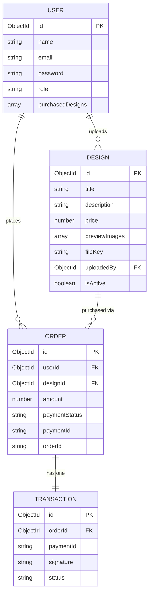

# CNC Design Marketplace - Complete System Design Documentation

## 1. API Endpoints List

### Authentication Paths (`/api/v1/auth`)
- `POST /register`: Create a new user account.
- `POST /login`: Authenticate and get JWT.
- `GET /me`: Get current logged-in user profile (Protected).

### Design Paths (`/api/v1/designs`)
- `GET /`: Get all active public designs.
- `GET /:id`: Get specific design details.
- `POST /`: Create a new design upload (Protected).

### Payment Paths (`/api/v1/payments`)
- `POST /orders`: Creates a Razorpay Order ID for a specific design (Protected).
- `POST /verify`: Verifies Razorpay signature and updates the Database to allow download (Protected).

### Download Paths (`/api/v1/downloads`)
- `GET /:designId`: Generate a temporary signed R2 URL if the user has purchased/owns the file (Protected).

---

## 1.5. Free Hosting Stack (MVP)
- **Frontend**: Vercel (Free, Auto Deploy)
- **Backend**: Render (Free Node.js Web Service)
- **Database**: MongoDB Atlas (Free M0 Cluster, 512MB)
- **Image Storage (Previews)**: Cloudinary (Free Tier, Fast Image Delivery, Watermarking)
- **File Storage (CNC Secure)**: Cloudflare R2 (Free Tier, S3-Compatible, No Egress)
- **DNS/CDN**: Cloudflare (Free SSL, DDoS protection)
- **Payments**: Razorpay (No monthly fee, pay per transaction)

---

## 2. Exact Razorpay Implementation Flow

1. **User Clicks Buy:** The frontend `DesignDetails.jsx` calls `createOrder(designId)`.
2. **Backend Config:** The `payment.controller.js` creates a Razorpay order from `razorpay.orders.create()` and saves a pending `Order` in the DB.
3. **Frontend Window:** Frontend opens the Razorpay popup using `window.Razorpay()`.
4. **User Completes Payment:** Razorpay triggers the `handler` function in frontend with `razorpay_payment_id`, `razorpay_order_id`, and `razorpay_signature`.
5. **Backend Verification:** The frontend posts this data to `/payments/verify`. The backend `payment.controller.js` verifies the cryptographic signature:
   ```javascript
    const sign = razorpay_order_id + "|" + razorpay_payment_id;
    const expectedSign = crypto.createHmac("sha256", process.env.RAZORPAY_KEY_SECRET).update(sign.toString()).digest("hex");
   ```
6. **Fulfillment:** If valid, the backend updates the User schema to include the purchased `designId` and updates the `Order` status to `success`. Download is now unlocked.

---

## 3. Cloudflare R2 Signed URL Code Flow

**Why?** This prevents direct hotlinking or piracy. The URL is only valid for a specific duration (e.g., 60 seconds) and Cloudflare R2 provides a generous free tier with zero egress fees!

**Implementation:**
The code is located in `backend/src/utils/generateSignedUrl.js`. When a user tries to download via `/api/v1/downloads/:designId`:
1. The backend verifies the user purchased the design.
2. It requests an encrypted, temporary URL from Cloudflare R2 using the standard `@aws-sdk/client-s3` library.
3. The frontend receives this URL and triggers the download automatically via Cloudflare's CDN.
4. If someone tries to share the link, it will expire within 60 seconds and throw an XML error page natively from R2.

---

## 3.5. Hybrid Storage Architecture (Images vs Files)

**Strategy:**
- **Cloudinary:** Used EXCLUSIVELY for rendering preview images. Why? Because Cloudinary offers incredible on-the-fly transformations (like auto-watermarking, sizing down, and converting to WEBP for speed).
- **Cloudflare R2:** Used EXCLUSIVELY for the raw `.dxf` or `.stl` CNC files. Why? Because it offers the native S3 Signed URL security flow allowing us to tightly lock down the raw paid assets.

**Flow:**
1. Designer uploads thumbnail -> Sent to Cloudinary -> URL stored in `previewImages` array.
2. Designer uploads DXF -> Sent to Cloudflare R2 bucket -> Key stored in `fileKey`.

---

## 4. Entity-Relationship (ER) Diagram (Text Representation)



---

## 5. Pitch Deck / Proposal Outline

### Slide 1: Title
- **Name:** CNC Market 
- **Tagline:** The Secure Vault for Premium CNC Designs.

### Slide 2: The Problem
- CNC designers spend hours creating precise DXF/STL models but face massive piracy when selling online.
- Existing platforms lack strong file protection and take huge percentage cuts.

### Slide 3: The Solution
- A specialized marketplace that ensures absolute file security via Expiring Signed Links (Cloudflare R2).
- Low/Zero transaction fees using native Razorpay integration.
- Immediate UI deterrence against image theft (disabled right-click, dynamic watermarks).

### Slide 4: Target Audience
- **Sellers:** CAD Designers, Engineers, Woodworkers.
- **Buyers:** CNC Machine Owners, Hobbyists, Fabricators, Laser Cutting Businesses.

### Slide 5: Revenue Model
- **Primary:** Free to post, 10% platform fee on all paid downloads (adjusted based on target).
- **Secondary:** Promoted designs (sponsored listings on the homepage).
- **Future:** SaaS-style subscription for bulk downloads.

### Slide 6: Technology Advantage
- **Frontend Layer:** React.js / Node / Tailwind (Vercel Hosted, Fast, SEO Optimized).
- **Security Layer:** Cloudflare CDN + Cloudflare R2 Private Storage (Files) + Cloudinary (Images).
- **Financial Layer:** Instant Razorpay payouts and fraud protection.

### Slide 7: Next Steps
1. Launch Beta MVP with 50-100 high-quality starting designs.
2. Market in dedicated Facebook "CNC Woodworking" and "Plasma Cutting" Groups.
3. Collect initial payment gateway feedback and refine UI.
